# Core Loot Manager aka Classic Loot Manager

## TL:DR;

Кратчайшая инструкция. С картинками. Но без анимации.

### Установить и настроить аддон

Одноразовая акция.

1. Установить с [Curseforge](https://www.curseforge.com/wow/addons/classic-loot-manager)
2. Выполнить команду ```/clm migrate```. CLM напишет в чатике, что таки мигрировал данные из CEPGP
3. Выполнить команду ```/reload```. CLM об этом попросил после миграции.
4. Зайти в настройки Аддона  - "Параметры -> Модификации -> Core Loot Manager -> Составы"
5. Установить округление EP и GP до 1

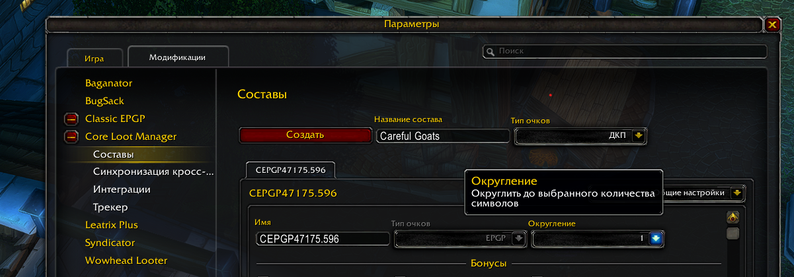

6. Установить стартовое GP в единицу

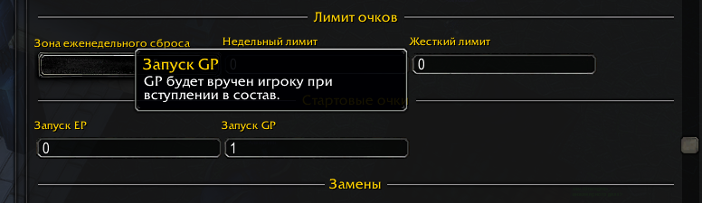

7. Замены

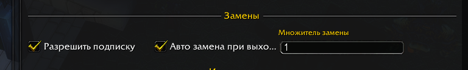

8. Настроить имена кнопок

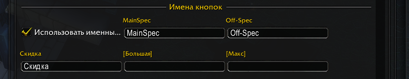

9. Настроить округление приоритета

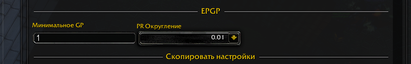

10. Перейти в настройки аукциона. Выбрать Многоуровневый

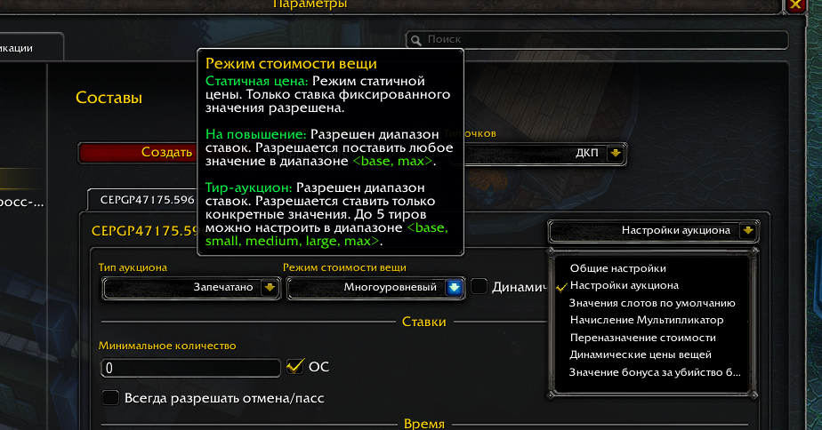

11. Настроить цены вещей

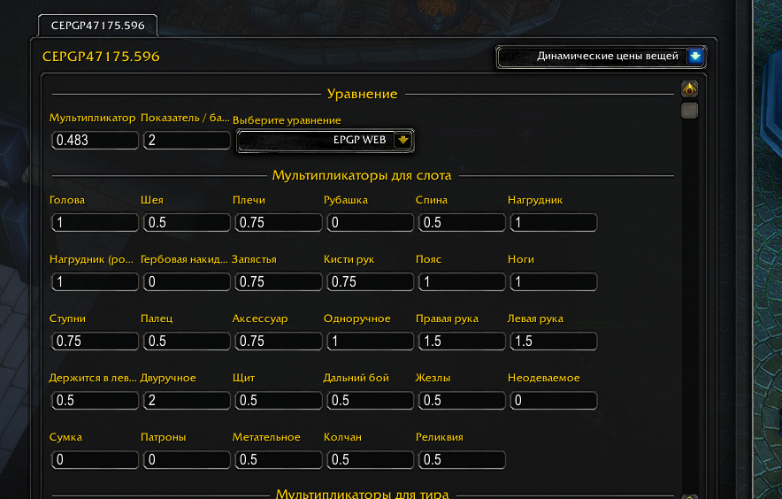

12. Настроить переопределение цен на токены. ```/clm importcsv``` и в появившемся окне вставить данные в CSV формате

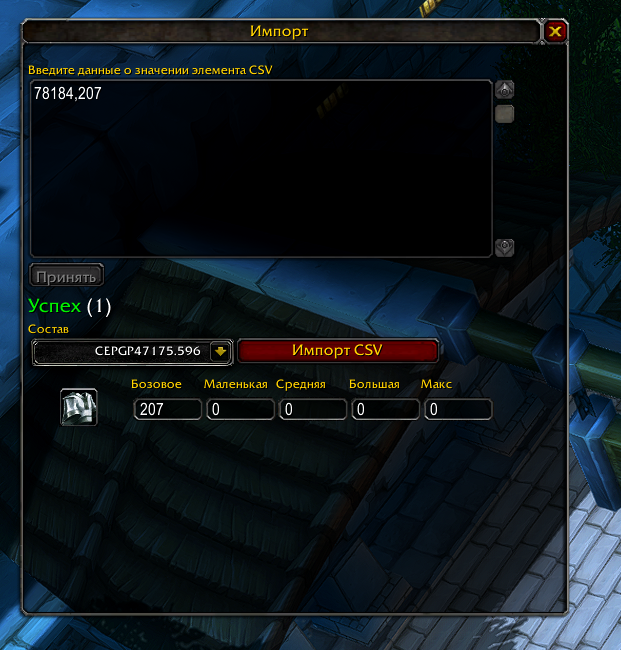

### Создать и запустить рейд
1. Открыть окно CLM. Например, нажав на кнопку возле мини-карты. Окромя того, есть команда ```/clm gui```
2. На закладке "Рейды" создать новый рейд. Указать имя и выбрать, какой состав туда идёт. Создавать можно заранее

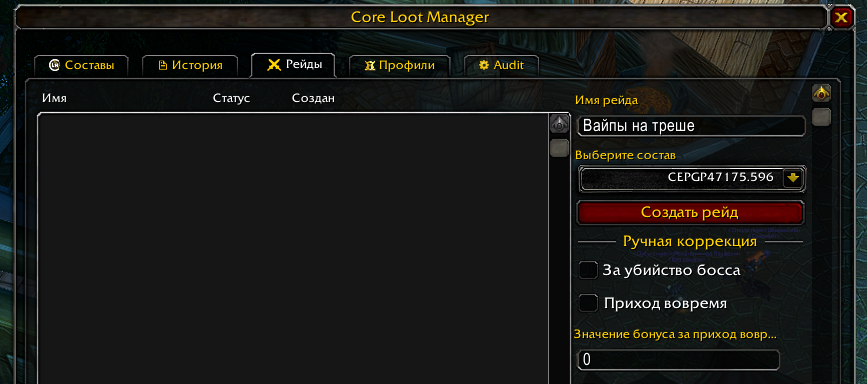

3. При начале рейда, т.е. в 20:00 среды или воскресенья - начать рейд в CLM.

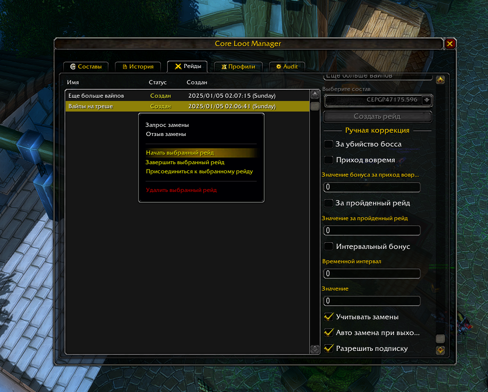

### Раздать лут
1. Окно старта "аукциона" на выпавшую вещь

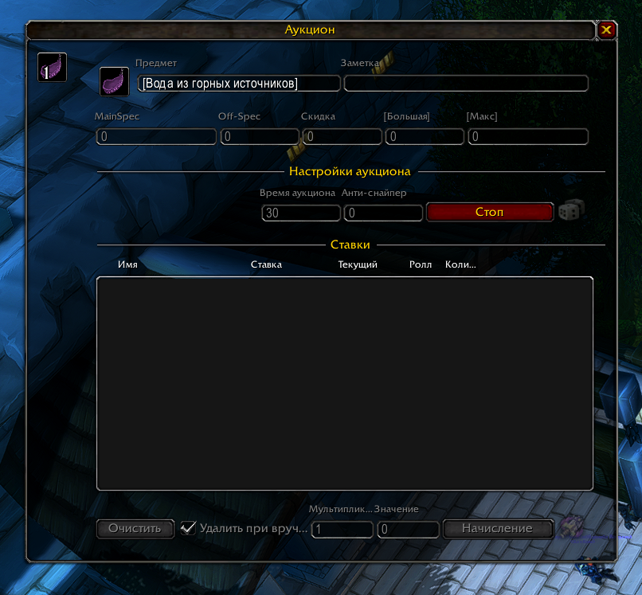

2. Окно, которое появится у рейдеров

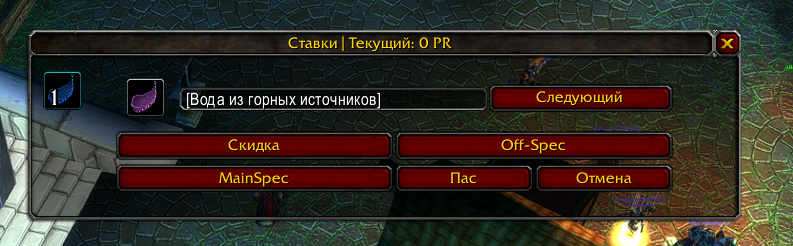

3. Для раздачи из сумки - Alt+ЛКМ.

### Начислить EP и завершить рейд
1. Начислить ЕП всем в рейде

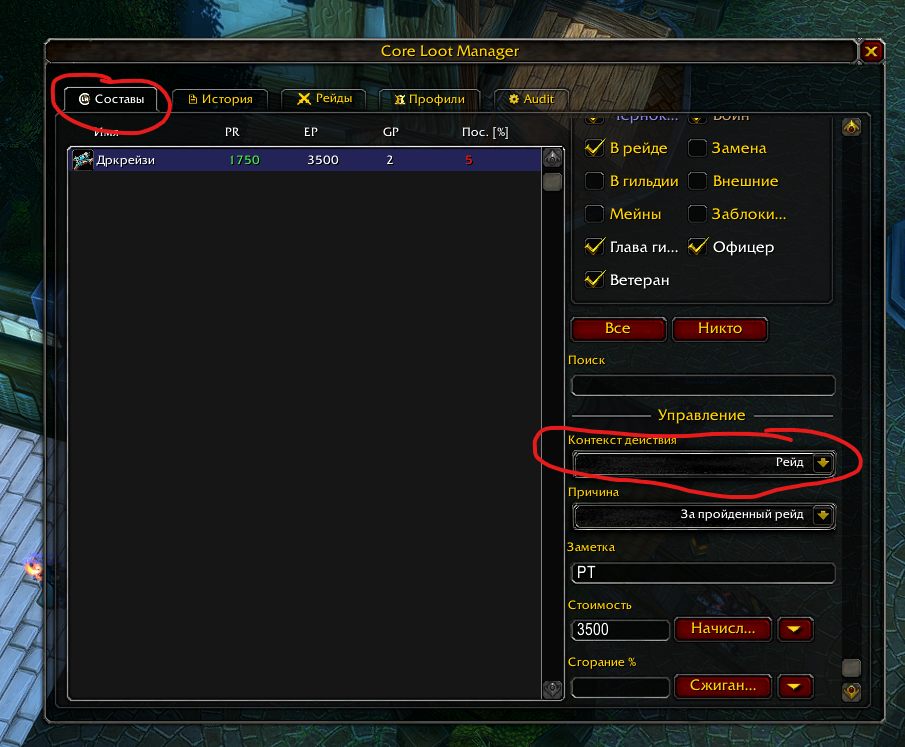

2. Завершить рейд

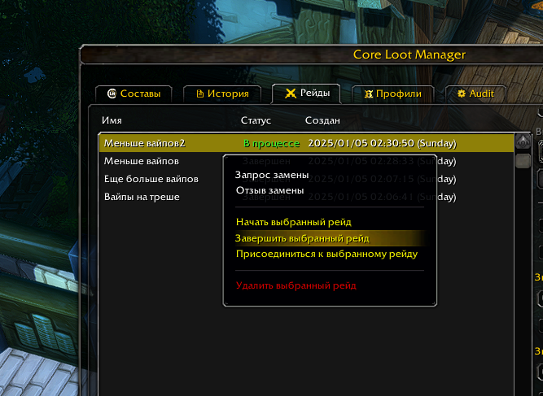


## Полезные ссылки
Wiki - https://github.com/CoreLootManager/CoreLootManager/wiki

Discord - https://discord.gg/Qjn8KdD8yt
